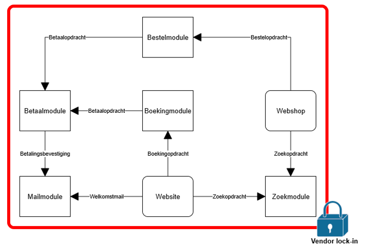

#Crawlable geospatial data using the ecosystem of the Web and Linked Data

# Apiwise
- Joost Farla & Dimitri van Hees
- Former Freshheads colleagues
- Founded in May 2015
- Platform Linked Data Netherlands

# Vision
The need to enrich and exchange data is rapidly increasing. The way in which data is accessible is critical to its value. We help organizations with publishing small, big, linked, open and/or closed data in a *developer-friendly* way through state-of-the-art semantic web APIs.

A programmable web, formed from a network of connected services, products, data and devices, each doing what it is good at, is the future of the Internet as we know it now.

## The Connected World

By opening up and managing services, products and data via APIs in a way that machines __*and*__ developers understand, it will be possible to integrate with other data, processes and algorithms.

## The API philosophy
- Separation of concerns
- Microservices
- API Oriented Architecture

## Traditional SOA solutions

## API Oriented Architecture

# The topic

## How can we make data crawlable?
- By search engines
- By webscrapers
- By developers
- By *things*

## How can we make data accessible?
- For machines
- For non-geo developers
- For non-expert users
- In a way it can be found

## How can we make data friendly?
- For machines
- For geo developers
- For non-geo developers
- For mobile developers
- For webdevelopers
- For the *Large Set of Unknown Developers*

## To speak in triples ;-)
| Subject| Predicate|Object|
| :------------- | :------------- |
| crawlable data | skos:broader | friendly data |
| friendly data | skos:broader | accessible data |
| accessible data | skos:broader | raw data |

# Expectations
We believe that offering a well-documented, findable and developer-friendly API with content-negotiated mediatypes is the best way to publish data, geospatial data included. By adding semantics using JSON-LD, the data might trigger search engines and crawlers like Apple Siri, Microsoft Cortana and Google Now, to boost search results and integrate the data, so that human readable questions could be answered.

This research topic focuses on crawlability and the publication of data using the modern ecosystem of the web, which is embraced perfectly by our vision: there is no Holy Grail, you should just publish as much formats as possible. We expect that bringing together the best of the worlds of content-negotiation, JSON-LD, REST and GeoJSON in a single publication strategy, will do this trick in a generic way for multiple datasets.

# Deliverables
- RESTful Geo-JSON API
- RESTful Geo-JSON-LD API
- Geo-JSON-LD converted RDF

- API specification documents which can be submitted to popular API search engines, portals and other API community tools.
- API documentation for better understanding on how the API works for consumers.
- API Software Development Kits (SDKs) and code examples.

- Different HTML representations which can be monitored through external tools (e.g. Google Analytics) to follow the crawlability performance (also after the research period, because search engines might need some time to process these pages). These representations will be hosted on different websites to test which representation (HTML + embedded JSON-LD, HTML + embedded RDFa, etc.) gets the highest score using the old SEO method of Trial and Error.
- Report with all the research outcomes, tested vocabularies and community communication.

# The challenges
- Dealing with technical limitations
- Extending schema.org
- Search Engine indexation frequency

# Machine-friendliness
- Search Engines
- Google Knowledge Graph
- Gmail
- Siri, Cortana, Now
- *Large Set of Unknown Devices*

## SEO best practices
- URI strategy
- XML sitemap
- Google Webmaster Tools
- HTML representation
- Structured data

## Schema.org
- W3C Community Group
- Topic 4
- Dan Brickley?

## URI strategies
- Dutch URI strategy concept
- RESTful URI strategy

# Developer-friendliness
- *Large Set of Unknown Developers*
- Documentation
- Code examples
- Standards
- *Time to First Successful Call*
- Compatibility

## Developer Experience (DX)

Facilitating better user experiences by making app development easier for developers.

*"User Experience applied to developers, because developers are people too!"*

http://developerexperience.org

## Content-negotiation
- Request `Accept` Header
- JSON: `application/json`
- JSON-LD: `application/ld+json`
- RDF: `application/nquads`
- HTML: `text/html`

# Procedure
- Agile/rapid development
- Result driven
- Collaboration with other topics
- Collaboration with the community
- Existing best practices (W3C groups)

# Involving the community

## ProgrammableWeb blog series
- [ProgrammableWeb.com](http://www.programmableweb.com)
- The environmental act
- Dutch initiatives
- Testbed progress

## Github usage
- Wiki
- Issues
- Discussion
- Presentations
- Reports

## Survey
Why don't just ask?

## Meetups

## Maintaining the project
Given the short time frame of the testbed, we want to setup a permanent community, even after the research period is ended. We will do this by open sourcing the whole project. If there is enough intended concern by March, we shall maintain and coordinate this open source project and continue the research.

# Questions?
